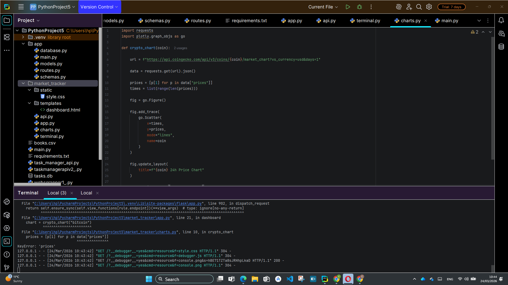
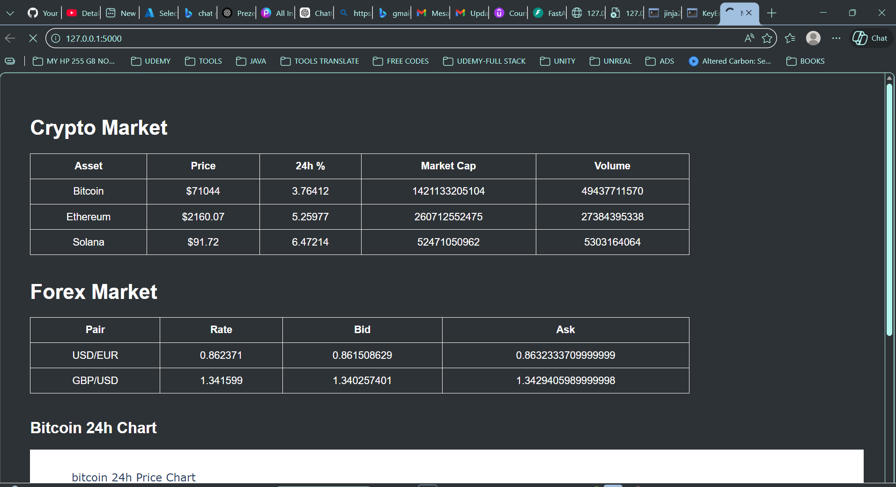
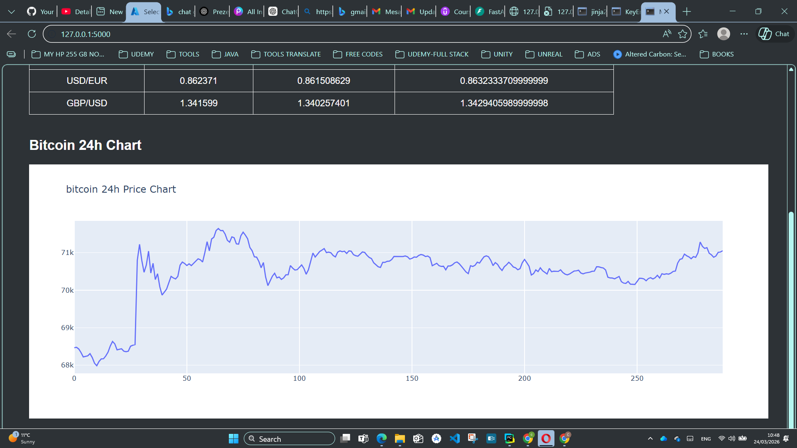

# 📊 Crypto & Forex Market Tracker

A real-time market tracking application that monitors **cryptocurrency prices** and **forex exchange rates** using free financial APIs.

The project includes both a **terminal dashboard** and a **web interface with charts**.

---

# 🎥 Demo Video

[](https://youtu.be/Jq7oqvY2V1w)

---

# 🚀 Features

- Real-time cryptocurrency prices
- Forex exchange rate tracking
- 24h price change monitoring
- Market capitalization and trading volume
- Bid / Ask rate simulation
- Multi-asset tracking
- Terminal dashboard
- Web dashboard with charts
- Auto-refresh market data

---

# 🖼 Screenshots

## Terminal Interface



---

## Web Dashboard



---

## Market Chart



---

# 🛠 Technologies Used

- Python
- Flask
- Requests
- Plotly
- Rich

---

# 📡 APIs

- CoinGecko (Cryptocurrency market data)
- ExchangeRate API (Forex rates)

Both APIs are **free and require no API key**.

---

# 📂 Project Structure

```
market_tracker
│
├── app.py
├── api.py
├── terminal.py
├── charts.py
│
├── templates
│   └── dashboard.html
│
├── static
│   └── style.css
│
└── images
    ├── interface_code.png
    ├── html1.png
    └── html2.png
```

---

# ⚙️ Installation

Clone the repository:

```
git clone https://github.com/YOUR_USERNAME/crypto-forex-market-tracker.git
```

Navigate to the project folder:

```
cd crypto-forex-market-tracker
```

Install dependencies:

```
pip install -r requirements.txt
```

---

# ▶ Run Web Dashboard

```
python app.py
```

Open in browser:

```
http://127.0.0.1:5000
```

---

# ▶ Run Terminal Dashboard

```
python terminal.py
```

---

# 📈 Future Improvements

- Live websocket price updates
- Technical indicators (RSI, MACD)
- Multi-coin chart dashboard
- Portfolio tracking
- Price alerts

---

# 📜 License

This project is open-source and available under the MIT License.
